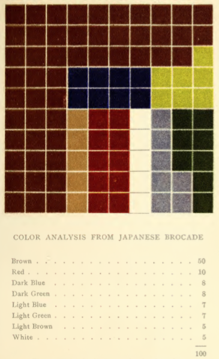
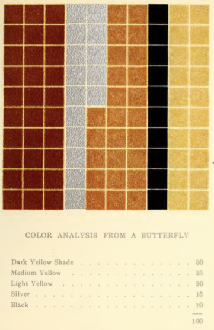
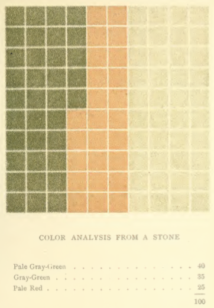
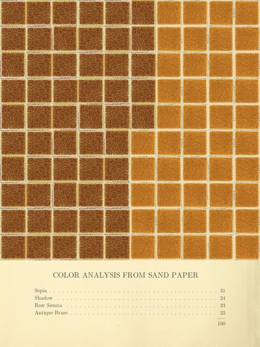
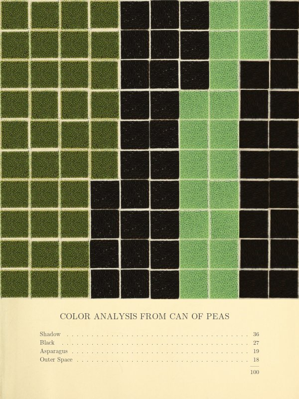
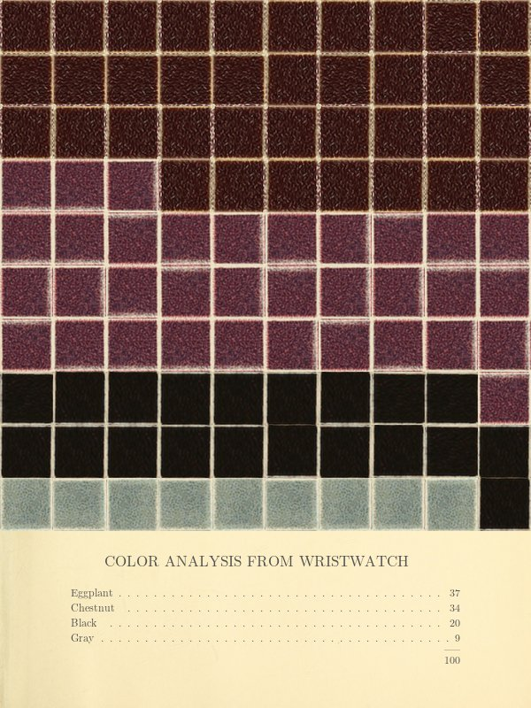

# Emily N. Vanderbot

A bot inspired by Emily Noyes Vanderpoel (1842-1939).

Vanderpoel's 1902 work, <a href="https://archive.org/details/colorproblemspra00vand">Color Problems</a> presents an idiosyncratic and impenetrable theory of color that culminates in dozens of abstract grids proporting to describe physical objects.

This program generates grids that evoke Vanderpoel's work:

* Select a random keyword from a set of objects in <a href="https://github.com/dariusk/corpora">corpora</a>)
* Find a related image from Flickr
* Extra the dominant colors from that image
* From a set of color tiles (hand-cut from the original work), find close match colors using a <a href="http://python-colormath.readthedocs.org/en/latest/delta_e.html">Delta E function</a>.
* Using a similar process, find matching color names drawn from the <a href="https://github.com/dariusk/corpora/blob/master/data/colors/crayola.json">corpora crayon color names</a>.
* Assemble a grid proportional to the color representations in the original
* Draw a table listing the color names and the number of matching tiles

## Originals

## Generated

## License
Copyright (c) 2016 Liza Daly  
Licensed under the MIT license.
